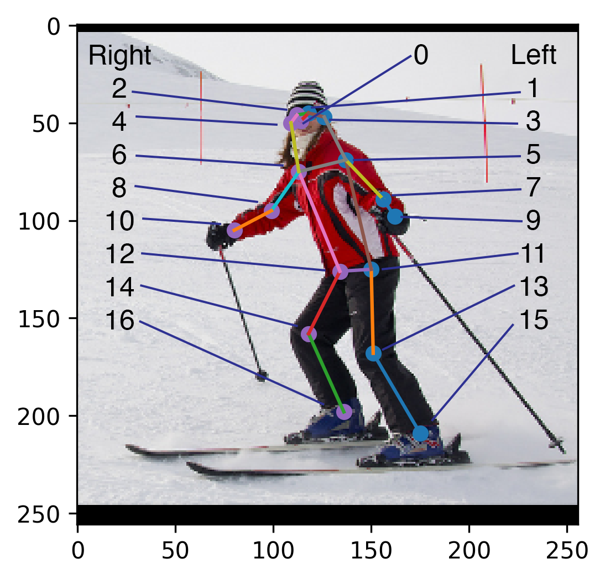
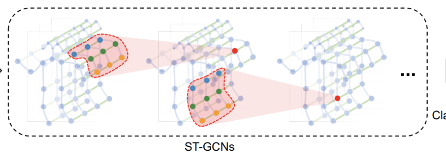

# **Violence Recognition From Human Pose Graphs**
*A Graph-Based Approach Using Spatiotemporal GCNs*

---

## **Abstract**
This project presents a real-time violence detection system built entirely on **graph representations of human pose**. Instead of using raw video, we detect and track human joints, convert them into multi-person spatiotemporal graphs, and apply a **Spatial–Temporal Graph Convolutional Network (ST-GCN)** to classify violent vs. non-violent interactions.

The core contribution is a **graph-centric representation** of motion and inter-person dynamics—clean, lightweight, interpretable, and suitable for real-time deployment.

---

# **1. Introduction**
Human motion can be expressed as a graph: joints as **nodes**, bones as **edges**, and temporal continuity across frames as **inter-layer edges**. This project leverages that idea by representing human interactions as structured graphs and training an ST-GCN to detect violent behavior using only these graph features.

Traditional RGB video models (3D CNNs, Vision Transformers) are powerful but computationally expensive.  
But our approach achieves  competitive performance while remaining fast, interpretable, and privacy-preserving.

---

# **2. Pipeline Overview (Graph-Centric Perspective)**

The system transforms raw video frames into multi-person spatiotemporal graphs:

Even though the pipeline uses detectors and trackers, *all components exist to build a clean, consistent graph representation* of human motion.

---

## **2.1 Pose Extraction: Graph Nodes**
We apply **YOLOv8-Pose** to every frame, extracting for each visible person:

- 17 joints → **17 graph nodes**  
- (x, y, confidence)  
- COCO bone connections → **intra-person edges**

This stage provides the raw geometric data that becomes the graph input.

---

## **2.2 Tracking as Graph Continuity**
Object tracking is essential because isolated frame detections cannot form a temporal graph.

We implement a **SORT-style** Kalman filter tracker:

- Predicts person position  
- Matches detections via IoU + Hungarian algorithm  
- Maintains consistent person IDs over time  

Tracking converts disjoint detections into **time-consistent node sequences**.

---

## **2.3 Skeleton Windows: Temporal Graph Segments**
For each tracked person, we segment their trajectory into overlapping windows.  
Each window becomes a temporal graph with:

- **Nodes:** 17 joints × T frames  
- **Spatial edges:** COCO skeleton  
- **Temporal edges:** same joint at t ↔ t+1  
- **Node attributes:**  
  - normalized (x, y)  
  - velocity  
  - acceleration  
  - confidence  

These windows are labeled violent/non-violent to train the ST-GCN.

When multiple people appear together, we combine their graphs using a **block-diagonal adjacency matrix** and add sparse **inter-person links** (hip-to-hip or shoulder-to-shoulder) to model physical interaction.

---

# **3. Knowledge Representation as Graphs**

## **3.1 Anatomical Structure as Prior Knowledge**
The COCO skeleton defines a fixed human-structure graph:

- nodes = anatomical keypoints  
- edges = biomechanical connections  

This prior graph encodes **human body knowledge**.

---

## **3.2 Temporal Edges as Motion Knowledge**
Temporal edges encode:

- motion continuity  
- propagation of movement  
- velocity & acceleration patterns  

This converts video motion into **graph reasoning**.

---

## **3.3 Inter-Person Links as Interaction Knowledge**
Violent behavior often involves multiple people.  
We introduce **inter-person edges** to explicitly encode relationships between individuals.

This allows the graph model to detect:

- approaching movements  
- pushing/pulling patterns  
- aggressive joint acceleration  
- physical contact cues  

This is the heart of multi-person graph representation.

---

# **4. ST-GCN Model**

The ST-GCN operates directly on the multi-person graph.  
Key configuration:

| Component | Specification |
|----------|--------------|
| Model | Multi-person ST-GCN |
| Adjacency | Block-diagonal COCO + inter-person links |
| Input channels | 7 |
| Graph nodes | 51 (3 persons × 17 joints) |
| Base channels | 64 |
| Dropout | 0.2 |
| Optimizer | AdamW |
| LR | 3e-4 |
| Batch size | 32 |
| Epochs | 10 |
| Scheduler | Cosine annealing |
| Device | MPS |
| Checkpoint | Best validation accuracy |

Graph convolutions allow the model to propagate information both **spatially** (across joints) and **temporally** (across frames).

---

# **5. Results**

### **Validation Metrics**
| Metric | Score |
|--------|-------|
| **Accuracy** | 0.7286 |
| **F1-score** | 0.7042 |

Even though transformer-based models outperform it on RGB data, our ST-GCN’s performance is strong given:

- no raw video  
- extremely low-dimensional input  
- real-time inference  
- high interpretability  

---

# **6. Discussion: Why Graphs Work Well**
Graph representation enables:

### ✔ **Interpretability**  
Edges and nodes correspond to body structure and motion.

### ✔ **Efficiency**  
Only 51 nodes → tiny computation footprint.

### ✔ **Robustness**  
Insensitive to lighting, background, or video noise.

### ✔ **Explicit knowledge encoding**  
The graph structure itself represents domain knowledge:
- anatomy  
- motion continuity  
- human interaction patterns  

This makes the project a natural fit for a **Knowledge Representation in Graphs** course.

---

# **7. Conclusion**
This project shows how violence detection can be achieved using **graph-based pose representations** rather than expensive RGB video models.  
The ST-GCN offers:

- real-time inference  
- interpretability  
- privacy-friendly processing  
- strong performance  
- explicit representation of human structural and interaction knowledge  

Graph-centric modeling proves to be an elegant and powerful alternative to raw-video-based methods.

---

# **8. References**
*(GitHub-friendly Markdown)*

1. Ultralytics YOLOv8 Pose – https://docs.ultralytics.com  
2. Kalman, R. E. (1960). *A New Approach to Linear Filtering and Prediction Problems.*  
3. Bewley, A., et al. (2016). *SORT: Simple Online and Realtime Tracking.*  
4. Kuhn, H. (1955). *The Hungarian Method for the Assignment Problem.*  
5. Lin, T.-Y. et al. (2014). *Microsoft COCO: Common Objects in Context.*  
