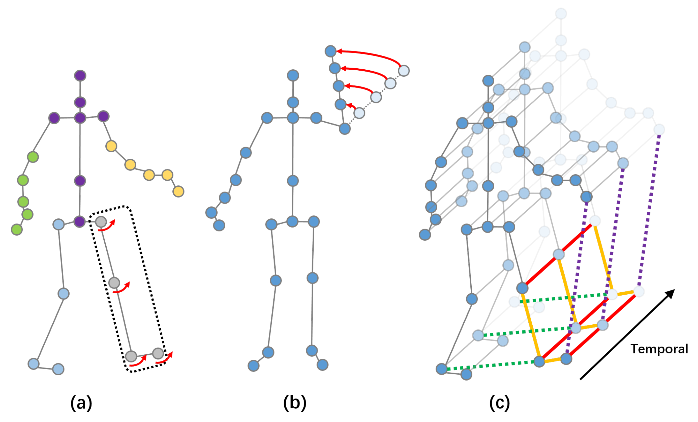
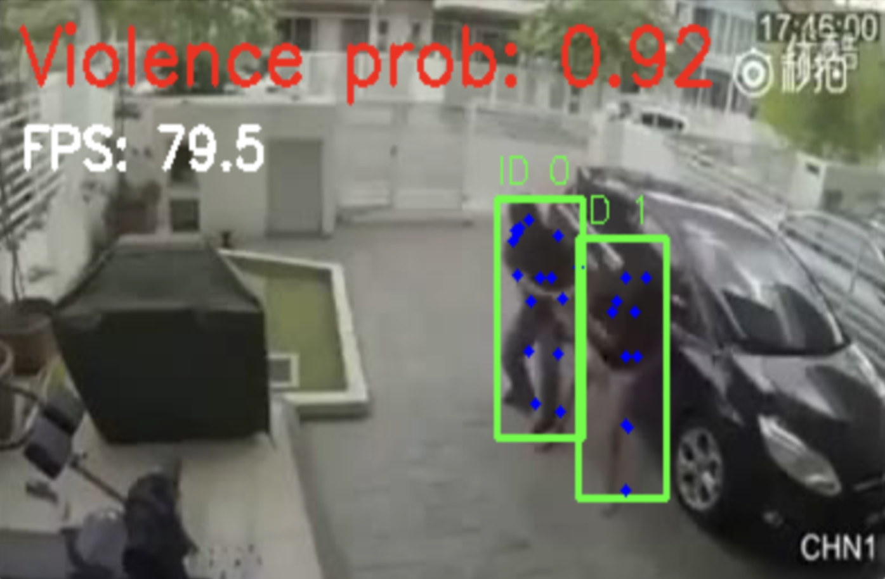

# **Violence Recognition From Human Pose Graphs**
*A Graph-Based Approach Using Spatiotemporal GCNs*

---

<script>
  MathJax = {
    tex: { inlineMath: [['$', '$'], ['\\(', '\\)']] }
  };
</script>
<script id="MathJax-script" async
  src="https://cdn.jsdelivr.net/npm/mathjax@3/es5/tex-mml-chtml.js">
</script>

<style>
  .page-content { font-size: 16px; }
  .page-content h1 { font-size: 32px; }
  .page-content h2 { font-size: 26px; }
  .page-content h3 { font-size: 22px; }
  .page-content h4 { font-size: 18px; }
</style>

### **The whole code with results you can find on our kaggle notebook** 
[Kaggle Notebook](https://www.kaggle.com/code/hubanoid/violence-detection-main)

## **Abstract**
This project presents a real-time violence detection system built entirely on **graph representations of human pose**. Instead of using raw video, we detect and track human joints, convert them into multi-person spatiotemporal graphs, and apply a **Spatial–Temporal Graph Convolutional Network (ST-GCN)** to classify violent vs. non-violent interactions.

The core contribution is a **graph-centric representation** of motion and inter-person dynamics—clean, lightweight, interpretable, and suitable for real-time deployment.

---

# **1. Introduction**
Human motion can be expressed as a graph: joints as **nodes**, bones as **edges**, and temporal continuity across frames as **inter-layer edges**. This project leverages that idea by representing human interactions as structured graphs and training an ST-GCN to detect violent behavior using only these graph features.

Traditional RGB video models (3D CNNs, Vision Transformers) are powerful but computationally expensive.  
But our approach achieves  competitive performance while remaining fast, interpretable, and privacy-preserving.

---

# **2. Pipeline Overview (Graph-Centric Perspective)**

The system transforms raw video frames into multi-person spatiotemporal graphs:


Even though the pipeline uses detectors and trackers, *all components exist to build a clean, consistent graph representation* of human motion.

---

## **2.1 Pose Extraction: Graph Nodes**
We apply **YOLOv8-Pose** to every frame, extracting for each visible person:

- 17 joints → **17 graph nodes**  
- (x, y, confidence)  
- COCO bone connections → **intra-person edges**

This stage provides the raw geometric data that becomes the graph input.


---

## **2.2 Tracking as Graph Continuity**
Object tracking is essential because isolated frame detections cannot form a temporal graph.

We implement a **SORT-style** Kalman filter tracker:

- Predicts person position  
- Matches detections via IoU + Hungarian algorithm  
- Maintains consistent person IDs over time  

Tracking converts disjoint detections into **time-consistent node sequences**.

---

## **2.3 Skeleton Windows: Temporal Graph Segments**
For each tracked person, we segment their trajectory into overlapping windows.  
Each window becomes a temporal graph with:

- **Nodes:** 17 joints × T frames  
- **Spatial edges:** COCO skeleton  
- **Temporal edges:** same joint at t ↔ t+1  
- **Node attributes:**  
  - normalized (x, y)  
  - velocity  
  - acceleration  
  - confidence  

Feature construction (per joint \(j\) at frame \(t\)):

$$
\tilde{\mathbf{p}}_{t,j} = \frac{(x_{t,j}, y_{t,j})}{(W, H)} \quad\text{(image normalization)}
$$

$$
\bar{\mathbf{p}}_{t,j} = \frac{\tilde{\mathbf{p}}_{t,j} - \text{hip}_{\text{center},t}}{\text{shoulder}_{\text{len},t} + \epsilon} \quad\text{(body-scale normalization)}
$$

$$
\mathbf{v}_{t,j} = \bar{\mathbf{p}}_{t,j} - \bar{\mathbf{p}}_{t-1,j}, \quad
\mathbf{a}_{t,j} = \mathbf{v}_{t,j} - \mathbf{v}_{t-1,j}
$$

$$
\text{feat}_{t,j} = [\,\bar{\mathbf{p}}_{t,j},\ \mathbf{v}_{t,j},\ \mathbf{a}_{t,j},\ \text{conf}_{t,j}\,] \in \mathbb{R}^7
$$

```python
# feature construction per joint j at frame t
coords = keypoints[..., :2] / np.array([[W, H]])          # image normalization
hip_center = coords[:, [11, 12]].mean(axis=1, keepdims=True)
shoulder_len = np.linalg.norm(coords[:, 5] - coords[:, 6], axis=-1, keepdims=True)
coords = (coords - hip_center) / (shoulder_len + 1e-6)    # body-scale normalization
vel = np.zeros_like(coords); vel[1:] = coords[1:] - coords[:-1]
acc = np.zeros_like(coords); acc[2:] = vel[2:] - vel[1:-1]
conf = keypoints[..., 2:3]
feat = np.concatenate([coords, vel, acc, conf], axis=-1)  # (T, 17, 7)
```

These windows are labeled violent/non-violent to train the ST-GCN.

When multiple people appear together, we combine their graphs using a **block-diagonal adjacency matrix** and add sparse **inter-person links** (hip-to-hip or shoulder-to-shoulder) to model physical interaction.


---

# **3. Knowledge Representation as Graphs**

## **3.1 Anatomical Structure as Prior Knowledge**
The COCO skeleton defines a fixed human-structure graph:

- nodes = anatomical keypoints  
- edges = biomechanical connections  

This prior graph encodes **human body knowledge**.

---

## **3.2 Temporal Edges as Motion Knowledge**
Temporal edges encode:

- motion continuity  
- propagation of movement  
- velocity & acceleration patterns  

This converts video motion into **graph reasoning**.

---

## **3.3 Inter-Person Links as Interaction Knowledge**
Violent behavior often involves multiple people.  
We introduce **inter-person edges** to explicitly encode relationships between individuals.

This allows the graph model to detect:

- approaching movements  
- pushing/pulling patterns  
- aggressive joint acceleration  
- physical contact cues  

---

# **4. ST-GCN Model**

The ST-GCN operates directly on the multi-person graph.  
Key configuration:

| Component | Specification |
|----------|--------------|
| Model | ST-GCN |
| Adjacency | Block-diagonal COCO + inter-person links |
| Input channels | 7 |
| Graph nodes | 51 (3 persons × 17 joints) |
| Base channels | 64 |
| Dropout | 0.2 |
| Optimizer | AdamW |
| LR | 3e-4 |
| Batch size | 32 |
| Epochs | 10 |

Graph convolutions allow the model to propagate information both **spatially** (across joints) and **temporally** (across frames).

---

# **4.1 ST-GCN Details**

**Input tensor:** `(N, C, T, V)` with `C=7` features, `T=30` frames, `V = persons × 17` (e.g., 51 for 3 people).

**Adjacency (multi-person):**

$$
A = \operatorname{blockdiag}(A_{\text{COCO}}^{(1)}, A_{\text{COCO}}^{(2)}, A_{\text{COCO}}^{(3)}) + A_{\text{hip-links}}
$$

$$
D = \operatorname{diag}\!\left(\frac{1}{\sum_j A_{ij}}\right), \quad A_{\text{norm}} = D A
$$

**Graph-temporal block:** for features $X \in \mathbb{R}^{N\times C\times T\times V}$: 


$$
X_{\text{spatial}} = \sum_{w} A_{\text{norm}}[v, w] \, X[:, :, :, w]
$$

$$
X_{\text{temp}} = \text{Conv}_{k_t=9,\,k_v=1}(X_{\text{spatial}})
$$

$$
Y = \operatorname{Dropout}\!\left(\operatorname{ReLU}\!\big(\operatorname{BN}(X_{\text{temp}})\big) + \text{Residual}(X)\right)
$$

**Stack:** channels `[64, 64, 64, 128, 128, 256]`, strides `[1, 1, 1, 2, 1, 2]` (temporal downsampling in blocks 4 and 6). Global average pool over `(T, V)` → linear classifier.

**Why the inter-person edges help (example):**  
With 2 people (V=34), hips are nodes 11 and 12 for person A and 28 and 29 for person B. Adding edges `(11↔28, 12↔29)` lets the model pass information about relative hip motion/contact, which is a strong cue for fights.

**Effective behavior:** adjacency encodes *who is connected*; normalized, body-scaled features encode *where and how they move*. Zeroed joints (low confidence or far away) send no messages but still receive from neighbors, so uncertainty does not break the graph.

---

# **5. Results**

### **Validation Metrics**

| Metric | Score |
|--------|-------|
| **Accuracy** | 0.7364 |
| **F1-score** | 0.7320 |
| **AUC** | 0.8001 |

Even though transformer-based models outperform it on RGB data, our ST-GCN’s performance is strong given:

- no raw video  
- extremely low-dimensional input  
- real-time inference  
- high interpretability 
 

---

# **6. Discussion: Why Graphs Work Well**
Graph representation enables:

### ✔ **Interpretability**  
Edges and nodes correspond to body structure and motion.

### ✔ **Efficiency**  
Only 51 nodes for 3 persons → tiny computation footprint.


### ✔ **Explicit knowledge encoding**  
The graph structure itself represents domain knowledge:
- anatomy  
- motion continuity  
- human interaction patterns  


---

# **7. Conclusion**
This project shows how violence detection can be achieved using **graph-based pose representations** rather than expensive RGB video models.  
The ST-GCN offers:

- real-time inference  
- interpretability  
- privacy-friendly processing  
- strong performance  
- explicit representation of human structural and interaction knowledge  

Graph-centric modeling proves to be an elegant and powerful alternative to raw-video-based methods.

---

# **8. References**

1. Ultralytics YOLOv8 Pose – [docs.ultralytics.com](https://docs.ultralytics.com)  
2. Kalman, R. E. (1960). *A New Approach to Linear Filtering and Prediction Problems.*  
3. Bewley, A., et al. (2016). *SORT: Simple Online and Realtime Tracking.*  
4. Kuhn, H. (1955). *The Hungarian Method for the Assignment Problem.*  
5. Lin, T.-Y. et al. (2014). *Microsoft COCO: Common Objects in Context.*  
6. Cheng, M., et al. (2020). *RWF-2000: An Open Large Scale Video Database for Violence Detection. In ICPR 2020.*​
7. Yan, S., Xiong, Y., & Lin, D. (2018). *Spatial Temporal Graph Convolutional Networks for Skeleton-Based Action Recognition (ST-GCN). In AAAI 2018.*
